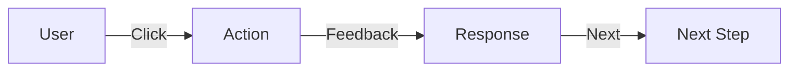

# UX Design Guide

Guide for user experience design and interaction patterns.

---

## 1. User Experience Principles

### Core UX Laws

| Law | Description | Application |
|-----|-------------|-------------|
| **Fitts's Law** | Time to reach target = distance/size | Make interactive elements large enough |
| **Hick's Law** | More choices = longer decisions | Reduce options per screen |
| **Jakob's Law** | Users prefer your site works like others | Follow conventions |
| **Miller's Law** | 7±2 items in working memory | Group information into chunks |
| **Primacy/Recency** | First and last items remembered best | Put important info at start/end |
| **Tesler's Law** | Every system has irreducible complexity | Don't oversimplify complex tasks |

### User Journey

```
┌─────────────────────────────────────────────────────────┐
│                    User Journey                        │
├─────────────────────────────────────────────────────────┤
│  Discover → Evaluate → Engage → Retain → Advocate  │
│     ↓         ↓          ↓         ↓          ↓       │
│  Landing  Product     Sign up   Use daily  Refer    │
│  pages    tour         flow       regularly   others  │
└─────────────────────────────────────────────────────────┘
```

---

## 2. Interaction Design

### Interaction Patterns

#### User Flows



#### Common Patterns

| Pattern | Use For | Example |
|---------|----------|---------|
| **Progressive Disclosure** | Complex forms | Show more options on expand |
| **Inline Validation** | Forms | Validate as user types |
| **Skeleton Screens** | Loading | Show placeholder while loading |
| **Pull to Refresh** | Mobile | Refresh content on pull |
| **Infinite Scroll** | Lists | Load more on scroll |
| **Breadcrumbs** | Navigation | Show current location |

### Feedback Systems

```typescript
// User action types
type Action = 'click' | 'hover' | 'input' | 'submit';

// Feedback types
type Feedback = 'success' | 'error' | 'warning' | 'info' | 'loading';

// Provide immediate feedback
function handleAction(action: Action): Feedback {
  switch (action) {
    case 'submit': return 'loading';
    case 'success': return 'success';
    case 'error': return 'error';
  }
}
```

---

## 3. Navigation Design

### Navigation Principles

| Principle | Description |
|----------|-------------|
| **Findability** | Users can locate what they need |
| **Accessibility** | Easy to reach all destinations |
| **Clarity** | Labels are clear and descriptive |
| **Consistency** | Navigation works the same everywhere |

### Navigation Types

| Type | Best For |
|------|----------|
| **Global** | Main sections (header) |
| **Local** | Within a section (sidebar) |
| **Contextual** | Related to current content |
| **Faceted** | Filter and sort options |
| **Supplemental** | Search, help |

---

## 4. Form Design

### Best Practices

#### Input Fields

```tsx
// Good form patterns
<form>
  <label htmlFor="email">Email</label>
  <input
    id="email"
    type="email"
    required
    placeholder="you@example.com"
    aria-describedby="email-hint"
  />
  <span id="email-hint">We'll never share your email.</span>
</form>
```

#### Validation Rules

| Rule | When to Show |
|------|---------------|
| Required | On blur or submit |
| Format | On blur |
| Availability | On blur (async) |
| All errors | On submit |

### Form Layout

```
┌────────────────────────────────────┐
│           Field Label              │
├────────────────────────────────────┤
│  [Input Field                    ]│
├────────────────────────────────────┤
│  Helper text / Error message      │
└────────────────────────────────────┘

Spacing: 16px between fields
Labels: Above inputs
```

---

## 5. Error Handling

### Error Prevention

- Constrain input (dropdowns, date pickers)
- Validate early and often
- Provide defaults when safe
- Confirm destructive actions

### Error Messages

| Element | Content |
|---------|---------|
| **What went wrong** | Clear, specific message |
| **Why it happened** | Explain the constraint |
| **How to fix it** | Actionable solution |

### Error Message Template

```
❌ Invalid email format
The email address must contain @ and a domain name.
Fix: Enter your email as user@example.com
```

---

## 6. Accessibility (a11y)

### WCAG Principles

| Principle | Description |
|-----------|-------------|
| **Perceivable** | Information presented can be perceived |
| **Operable** | Interface components are operable |
| **Understandable** | Information and operation understandable |
| **Robust** | Content robust enough for all users |

### Implementation

```css
/* Focus states - always visible */
:focus {
  outline: 2px solid blue;
  outline-offset: 2px;
}

/* Skip link for keyboard users */
.skip-link {
  position: absolute;
  top: -40px;
  left: 0;
  background: blue;
  color: white;
  padding: 8px;
  z-index: 100;
}

.skip-link:focus {
  top: 0;
}
```

### Checklist

- [ ] Color contrast ≥ 4.5:1
- [ ] Focus states visible
- [ ] Keyboard navigable
- [ ] ARIA labels where needed
- [ ] Alt text for images
- [ ] Form labels associated

---

## 7. Usability Testing

### Testing Methods

| Method | What It Reveals | When |
|--------|----------------|------|
| **Usability Lab** | Task success | During design |
| **A/B Testing** | Preference between options | After launch |
| **Card Sorting** | Information structure | Early |
| **Tree Testing** | Navigation clarity | Before build |
| **Eye Tracking** | Visual attention | Research |

### Test Metrics

| Metric | Description |
|--------|-------------|
| **Task Success** | % completed successfully |
| **Time on Task** | How long to complete |
| **Error Rate** | Mistakes made |
| **Satisfaction** | User rating (SUS) |

---

## 8. Mobile UX

### Touch Guidelines

| Element | Minimum Size | Spacing |
|---------|--------------|---------|
| Touch targets | 44x44px | 8px between |
| Buttons | Full width on mobile | 16px padding |

### Mobile Patterns

- Bottom navigation for main sections
- Swipe gestures for common actions
- Pull to refresh
- Infinite scroll for lists
- Modal sheets for detail views

---

## Validation Checklist

- [ ] User flows are logical
- [ ] Navigation is intuitive
- [ ] Forms are easy to complete
- [ ] Errors are helpful
- [ ] Accessible to all users
- [ ] Works on all devices
- [ ] Tested with real users
